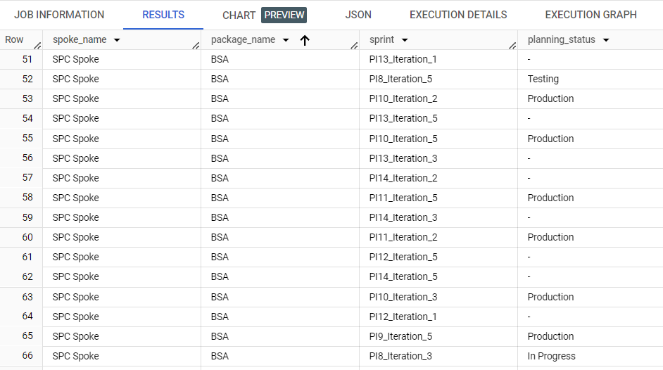
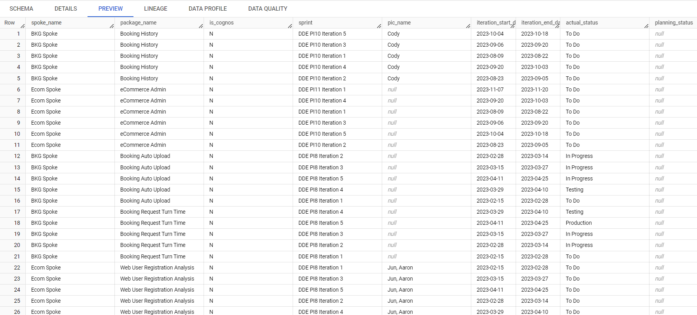
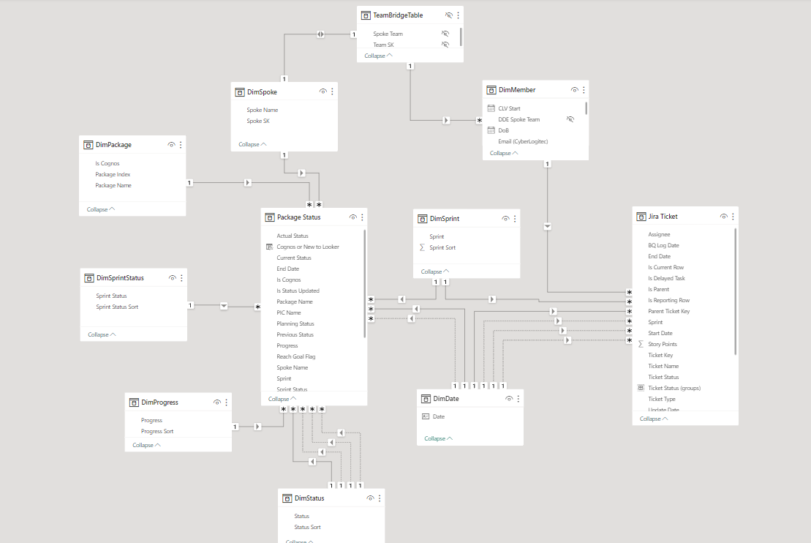

## DDE Project Development

### Scenario: 
A team currently working in an software development project where task will be broken down into a number of sprints. As the project is scaling up, the leader requires creating a dashboard to track the development progress of these software packages and the workload of team members.

### Data transformation:
These data are currently stored in BigQuery. While the raw data of each member's workload are already cleaned and ready for use, further transformation are still needed for the data of software packages' status in order to create a usable dashboard.

- [SQL transformation script](https://github.com/mk-duong/data-porfolio/blob/main/PowerBI_Data_Visualization/SQL/packages_status_transform.sql)

- Raw data:
  
  
  
- Transformed data:
  
  

### Data modelling:
Since star schema design are highly relevant to developing Power BI models especially when many fact tables sharing the same dimensions, Power Query Editor has been used to create different dimension tables from two fact tables (Package Status and Jira Ticket) and create relationships among them.



### Using DAX:
DAX is used to create various measures and custom dimensions in my model, for example:
+ Create string aggregation

```
Aggregate Package = 
  CONCATENATEX(
    VALUES('Package Status'[Package Name]),
    'Package Status'[Package Name],", ")
```
+ Create aggregation in a filtered context

```
Average Hit Target Rate = 
VAR HitTargets = 
    CALCULATE(
        DISTINCTCOUNT('Package Status Compare'[Package Name]),
        'Package Status Compare'[Reach Goal Flag]=True)

VAR TotalPackages = DISTINCTCOUNT('Package Status Compare'[Package Name])

RETURN DIVIDE(HitTargets, TotalPackages) + 0
```

+ Create custom dimension
```
Cognos or New to Looker = IF('Package Status Compare'[Is Cognos]="Y", "Cognos", "New to Looker")
```

### Dashboard:
Since sharing is limited in Power BI, I've created GIFs to show the interactiveness of dashboard!

If the GIFs take too long to load, please refer to this [folder](https://github.com/mk-duong/data-portfolio/tree/main/PowerBI_Data_Visualization/images) to see the dashboard snapshots.


