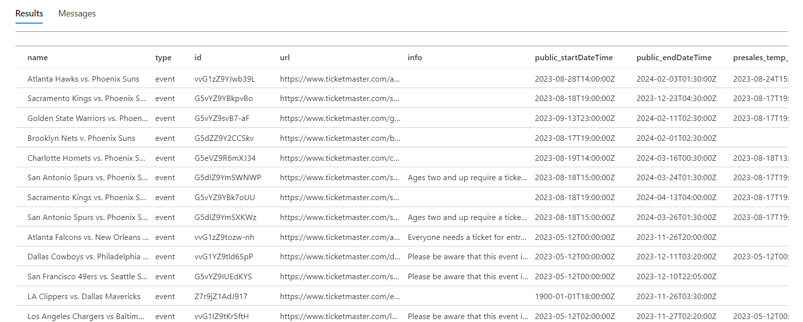
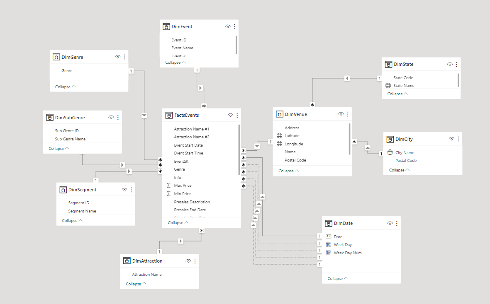
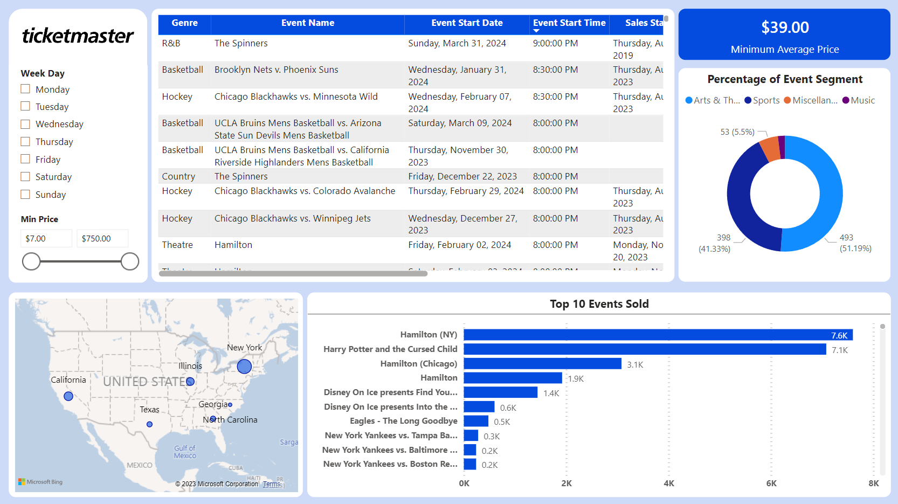

## Ticketmaster ETL Pipeline

### Dataset:

[Ticketmaster API](https://developer.ticketmaster.com/) was used to fetch raw data of events.

### Data ingestion:

This [Python script](Python%20&%20SQL/ingest_data.py) creates a workflow of data ingestion by first using API to fetch information of events. Since the extracted data is returned as a nested JSON file, it needs to be flattened before being loaded into data warehouse. 

### Data transformation & modelling:
Regarding data warehouse, I've decided to use Azure SQL Database to gain experience with the cloud version of SQL Server, from intializing a database in Azure portal to creating connection congfiguration with Python. The following image shows how raw data is stored in the database:

From the raw data, further [SQL transformation](Python%20&%20SQL/transform_data.sql) is carried out to rename the columns and recast the values with date data type to a cleaner format. 

Star schema data modelling was also done in the data warehouse so that dimension and fact tables can be imported directly into Power BI to ensure model consistency in case it is shared among other users. The following image shows how the imported dimension and facts table would look like in Power BI:

### Data visualization:
Lastly, data is visualized to show which events are available in six U.S. regions and their respective information on sales date, start date, venues, etc. as well as top selling events up-to-date.

### Limitations:
Since the free limit of Ticketmaster API only allows a maximum of 1000 records per request, I had to narrow down the number of U.S. regions in which events are extracted. Also, due to the lack of actual ticket sales data, dummy data was created instead. While this project can be expected to be more refined regarding the aforementioned aspects, it still provides me a chance to improve my knowledge in writing Python code and practicing writing SQL as well as visualizing in Power BI.
