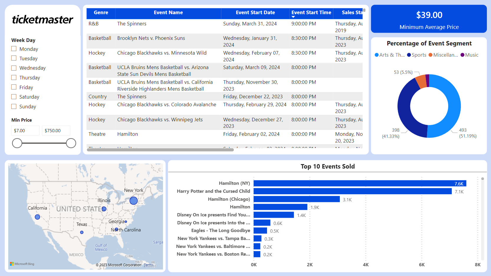

# Ticketmaster ETL Pipeline

## Description
A starter data pipeline project with Python, dbt, Docker, Airflow, and Postgres. This project is used to demonstrate my understading on ETL/ELT frameworks and how to design a simple data flow by using Ticketmaster API to extract events data from Ticketmaster with Python. Data is then transformed with Python and dbt before being loaded into Postgres database orchestrated by Airflow. Finally, PowerBI is used for visualizing event information.

## Dataset

[Ticketmaster API](https://developer.ticketmaster.com/) was used to fetch raw data of events (e.g., concerts, sport events, etc) around the world. Working with this dataset has also helped me familiarize with API use as well : )

## Architecture

## Visualization

